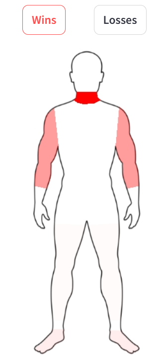
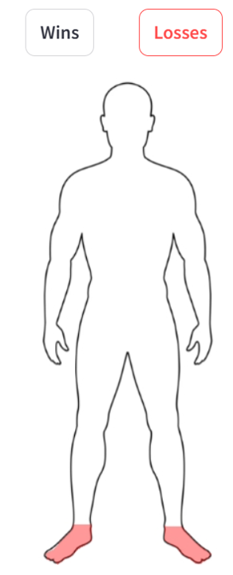

# Jiu-Jitsu Analytics

## 🥋 Visão Geral

Este projeto é uma visualização interativa de dados de Jiu-Jitsu desenvolvida com Streamlit. O principal objetivo do projeto é identificar as partes do corpo onde o atleta selecionado é mais eficiente atacando (nas vitórias) e onde ele tende a se expor (nas derrotas). Outras análises estão disponíveis, como a evolução do número de lutas competitivas de Jiu Jitsu ao longo dos anos. Em breve novas análises serão implementadas! 

Segue o link para acessar o Dashboard: https://app-jiu-jitsu-szkogmnlelxfot2qehc8eh.streamlit.app/

## 📌 O Projeto

O desenvolvimento do projeto seguiu as seguintes etapas:

1️⃣ **Coleta de Dados:** Realizei Web Scraping com a biblioteca Beautiful Soup para obter a base de dados;  
2️⃣ **Armazenamento:** A base foi inicialmente armazenada em um banco PostgreSQL local, utilizando SQLAlchemy. Posteriorment, fiz a migração para o Tembo, um serviço de cloud com um free tier excelente;  
3️⃣ **Dashboard:** Usei o Streamlit para criar uma visualização interativa dos dados;  
4️⃣ **Deployment:** Utilizei a própria plataforma do Streamlit (Streamlit Community Cloud) para realizar o deploy do projeto. 

A principal funcionalidade se encontra na página "Fighter Analysis". Nessa página você encontra o mapa de calor do corpo humano, destacando as áreas em que o atleta selecionado é mais eficiente atacando (nas vitórias) e onde ele tende a se expor (nas derrotas). 

Vamos usar como exemplo o Micael Galvão (do qual sou muito fã): 

A imagem a seguir mostra as áreas que históricamente o Mica é mais eficiente nos ataques. É perigoso deixar os braços, e principalmente, o pescoço desprotegido em uma luta contra o Micael. 

  

Nas poucas derrotas por finalização que o Micael Galvão sofreu, o seu pé/tornozelo foi atacado, o que indica que esse pode ser um caminho a ser explorado pelos adversários. 

  

Além disso, na página "General Analysis" você pode visualizar algumas análises gerais sobre o esporte:  
- Evolução do número de lutas competitivas de Jiu-Jitsu ao longo dos anos;
- Número de lutas que cada equipe teve. Identificamos que a equipe com o maior número de lutas é a Alliance.

Você pode usar uma série de filtros para visualizar os dados da forma que preferir. 

Em breve novas analises serão implementadas!

## 🛠️ Tecnologias Utilizadas

**Linguagens:**   
- Python

**Bibliotecas e Módulos:**  
- Pandas
- Streamlit
- Matplotlib
- Seaborn

**Banco de Dados:**   
- PostgreSQL

**Plataforma Clound:**  
- Tembo.io  
- Streamlit Community Cloud

## 📋 Pré-Requisitos  
Instalar Python  
Instalar dependências do projeto:  
bash
Copiar código
pip install -r requirements.txt

## 🗂️ Estrutura do Projeto
bash  
Copiar código  
.
├── main.py              # Arquivo principal para rodar o app Streamlit
├── data/                # Arquivos de dados (se aplicável)
├── images/              # Imagens e banners utilizados no projeto
├── utils/               # Scripts de apoio
├── README.md            # Documentação do projeto
└── requirements.txt     # Dependências do projeto

## 🚀 Como Rodar o Projeto
Para iniciar o aplicativo em um ambiente local, siga estas etapas:

bash
Copiar código
## Clone o repositório
git clone https://github.com/seu_usuario/jiu-jitsu-data-analysis.git

## Navegue até a pasta do projeto
cd jiu-jitsu-data-analysis

## Execute o Streamlit
streamlit run main.py

## 💡 Principais Desafios e Soluções
Implementação do Mapa de Calor
Explicação breve sobre os desafios enfrentados e como foram resolvidos para criar o mapa de calor das áreas de ataque/defesa.

Otimização de Consulta ao Banco de Dados
Breve explicação sobre as estratégias utilizadas para melhorar a eficiência das consultas ao banco de dados PostgreSQL.

## 🤝 Contribuições
Contribuições são bem-vindas! Para contribuir, faça um fork do projeto e envie um pull request.
